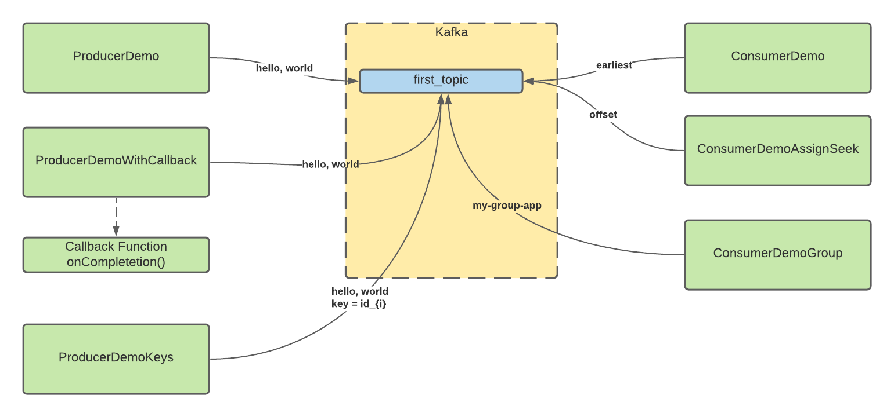
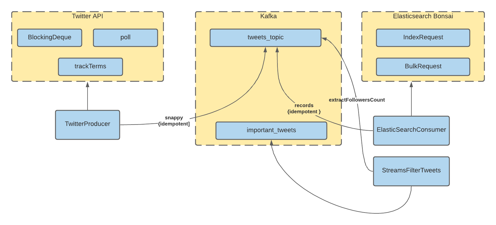

# Kafka Tutorial
### This is a _step-by-step_ Kafka Tutorial to move you from beginner to advanved level in Kafka. This tutorial was inspired from [Apache Kafka course](https://www.udemy.com/course/apache-kafka/) that I recommed a lot.

## This repository contains the structure below:
- kafka-basics
- kafka-producer-twitter
- kafka-consumer-elasticsearch
- kafka-streams-filter-twitter

## To build this repository you will need:
- [Java JDK8](https://openjdk.java.net/projects/jdk8/)
- [Maven](https://maven.apache.org/)
- [IntelliJ](https://www.jetbrains.com/pt-br/idea/)
- [Apache Kafka installed on-promise in your machine](https://kafka.apache.org/)
- [Elaticsearch installed on-promise in your machine or use shift-cloud provider as Bomsai](https://app.bonsai.io/)
- [Elasticsearch API](https://www.elastic.co/guide/en/elasticsearch/reference/7.16/cat-health.html)
- [Knowloge about basic and intermediate Java 8 concepts such as Generics, Lists, Streams and Modules](https://www.journaldev.com/2389/java-8-features-with-examples)

## To make sure that you have all dependencies check this command in root folder

```
mvn clean package
```
## Learning Kafka from this tutorial
## Kafka-basics


## Twitter + Kafka-consumer-elasticsearch


## Basic CLI to start in Kafka
1. Installing Apache Kafka from wget
```
 $ wget https://dlcdn.apache.org/kafka/3.0.0/kafka_2.12-3.0.0.tgz
 $ tar xzvf kafka_2.12-3.0.0.tgz
 $ cd kafka_2.12-3.0.0
 $ kafka-topics.sh # checking installation 
                   # it shows help logs from kafka-topics.sh command
```
2. Instarting Kafka brokers and Zookeper
```
 $ zookeeper-server-start.sh ~/kafka_2.12-3.0.0/config/zookeeper.properties
 $ kafka-server-start.sh ~/kafka_2.12-3.0.0/config/server.properties
```
3. Creating a first topic
```
kafka-topics.sh --bootstrap-server localhost:9092 --topic first_topic --create --partitions 3 --replication-factor 1 # this command create a new topic
                                      # it requires minimum partitions = 3 and 
                                      # replication factor = 1
                                      # The ISR is simply all the replicas of a partition that are "in-sync" with the leader partition. 
```
4. Listing topics
```
 $ kafka-topics.sh --bootstrap-server localhost:9092 --list
```

5. Starting a consumer from CLI
```
 $ kafka-console-consumer.sh --bootstrap-server localhost:9092 --topic first_topic
```

6. Starting a producer form CLI
```
 $ kafka-console-producer.sh --bootstrap-server localhost:9092 --topic first_topic
```

7. Replying data from begginning based on current offset
```
 $ kafka-console-consumer.sh --topic first_topic --bootstrap-server localhost:9092 --from-beginning
```
8. Describe topics from groupds
```
 $ kafka-consumer-groups.sh --bootstrap-server 127.0.0.1:9092 --group kafka-demo-elasticsearch --describe
```
9. Resseting offsets from group to replying data
```
 $ kafka-consumer-groups.sh --bootstrap-server 127.0.0.1:9092 --group kafka-demo-elasticsearch --execute  --reset-offsets --to-earliest --topic tweets_topic --to-earliest
```

